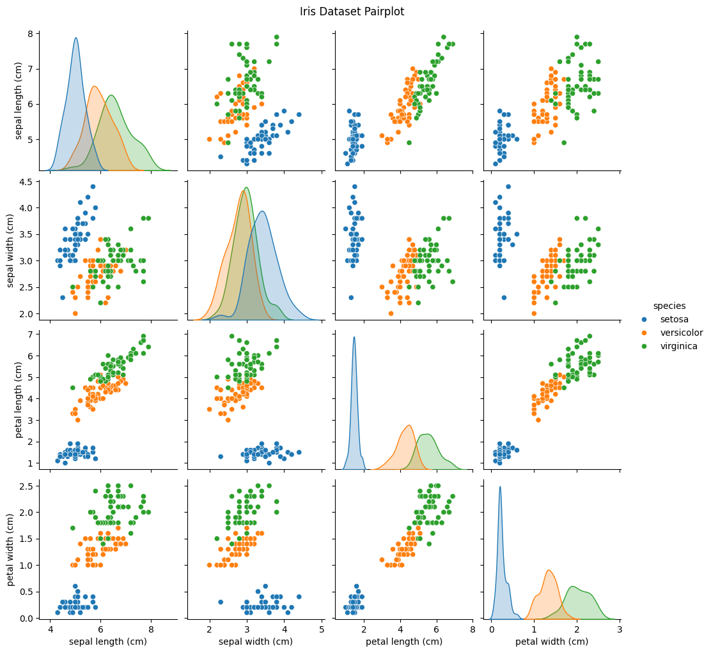

# 🌸 Task 4: Iris Flower Classification 🌸  

**Objective:**  
Build machine learning models to classify **Iris flower species** into *Setosa, Versicolor,* or *Virginica* using classification algorithms.  

---

## 📂 Dataset  
- **Source:** Built-in Iris dataset (`sklearn.datasets.load_iris`)  
- **Features:** Sepal Length, Sepal Width, Petal Length, Petal Width  
- **Target:** Species (Setosa, Versicolor, Virginica)  

---

## 🔎 Steps Completed  
✔️ Loaded and explored the dataset  
✔️ Visualized feature distributions using **Pairplot**  
✔️ Split data into **Train/Test sets**  
✔️ Trained two models:  
   - Logistic Regression  
   - K-Nearest Neighbors (KNN)  
✔️ Evaluated performance with **Accuracy & Classification Report**  
✔️ Predicted species for new unseen data  

---

## 📊 Results  
| Model                  | Accuracy | Notes |
|-------------------------|----------|-------|
| Logistic Regression     | 100%     | Perfect classification |
| K-Nearest Neighbors     | 100%     | Perfect classification |

Both models achieved **100% accuracy**, showing clear class separations in the Iris dataset.  

---

## 🌸 Visualization  
Pairplot clearly shows species separation:  

  

---

## 🛠️ Tech Stack  
- **Python**  
- **Pandas**  
- **Scikit-learn**  
- **Seaborn & Matplotlib**  

---

## 🚀 Key Takeaways  
- Logistic Regression & KNN are highly effective for structured, well-separated datasets.  
- Visualization before modeling helps understand feature relationships.  
- Evaluation metrics confirm robustness across all classes.  

---
