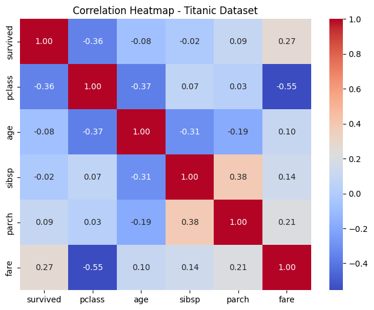

# ✅ Task 5: Visualizing Correlations – Titanic Dataset  

**Objective:**  
Analyze relationships between numerical features using a **correlation heatmap** to identify strong, weak, and negative correlations.  

---

## 📂 Dataset Details  
- **Source:** Titanic dataset (`seaborn.load_dataset('titanic')`)  
- **Features Used:**  
  - `survived` – Survival status (0 = No, 1 = Yes)  
  - `pclass` – Passenger class  
  - `age` – Age of passenger  
  - `sibsp` – Number of siblings/spouses aboard  
  - `parch` – Number of parents/children aboard  
  - `fare` – Ticket fare  

---

## 🔎 Steps Completed  
✔️ Loaded the Titanic dataset using Seaborn  
✔️ Selected **numerical columns** only  
✔️ Computed **correlation matrix** using `df.corr()`  
✔️ Visualized with **Seaborn Heatmap** (`annot=True`, `coolwarm` colormap)  
✔️ Interpreted the correlations to extract insights  

---

## 📊 Correlation Heatmap  
  

---

## 🔍 Key Insights  
- **Strongest Positive Correlation:**  
  `parch` ↔ `sibsp` (0.38) → Families often traveled together.  
- **Strongest Negative Correlation:**  
  `pclass` ↔ `fare` (-0.55) → Higher-class tickets cost more.  
- **Survival Correlation:**  
  `fare` shows a **positive correlation (0.27)** with survival → Higher fare passengers had better chances of survival.  
- **Age & Survival:**  
  Weak negative correlation (-0.07) → Age didn’t strongly influence survival.  

---

## 🛠️ Tech Stack  
- `Python`  
- `Pandas`  
- `Seaborn`  
- `Matplotlib`  

---

## ✅ Key Takeaways  
- Correlation heatmaps are useful for **feature selection** in machine learning.  
- Strong correlations (positive/negative) can indicate **important relationships**.  
- Visualizations make data patterns easier to understand.  
